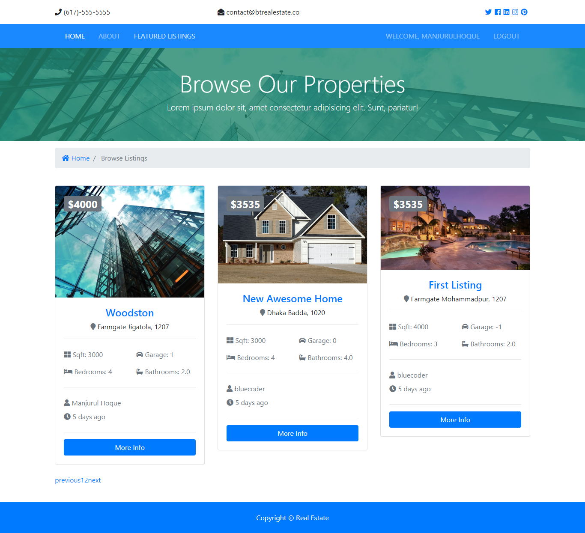
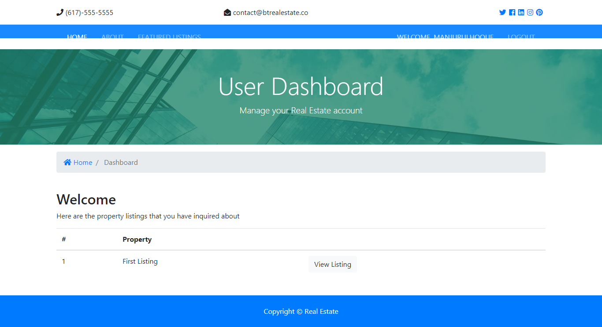

## Simple Real State Application

I used Django as a backend and Reactjs as frontend.

[API is here](https://github.com/manjurulhoque/django-real-state)

For state Management I used [Redux](https://redux.js.org/)

### Screenshots

## Home page

## Registration

